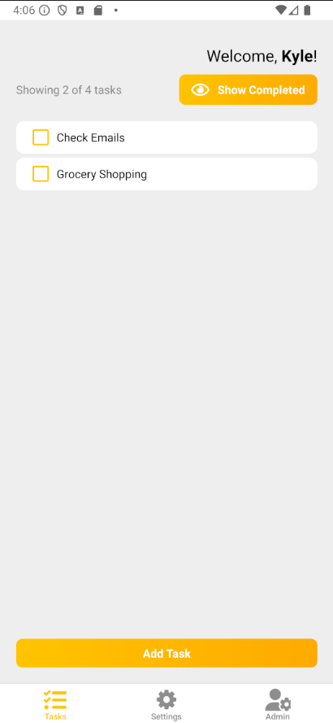

# Byte Press Mobile App

Example React native mobile todo app.

## Prerequisites
 * node js (https://nodejs.org/en)
 * Android Studio (https://developer.android.com/studio)

## Getting Started

1. Clone the repo `git clone https://github.com/kylemccullen/byte-press-mobile.git`
2. Install dependencies `npm i`
3. Create `./secrets.ts` and set the FORWARD_API to the value output of running ngrok. You can also set a debugValue for email or password to auto-set the login form each time.
    ```ts
    export const FORWARD_API = "https://<random-url-key>.ngrok-free.app";
    export const debugValues = {
        email: "",
        password: ""
    }
    ```
4. Run the app `npx expo start`

## App Screenshot
